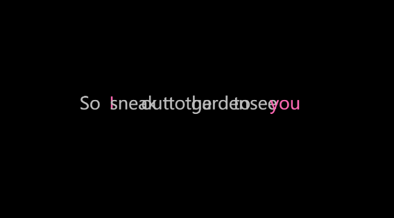

# HW07
## Text
For this assignment, I choose the song **"Love Story"** by Taylor Swift.This song tells a classic romantic tale inspired by Romeo and Juliet, expressing themes of young love, determination, and a happy ending.

## Animation
The animation visualizes lines from the song using dynamic text display. Each line of the lyrics appears rhythmically on the screen, with specific words like "I," "you," "me," and "love" highlighted in pink.

The text pulses in size to create a heartbeat effect, representing the emotions of the story. Additionally, the word "love" appears larger than other words, highlighting its central theme. The animation transitions between lines every 2 seconds, creating a lively reading experience of the song's lyrics.

## Background
A semi-transparent image of a rose serves as the background, symbolizing love and romance. The transparency effect ensures that the text remains clearly visible while adding a layer of warmth and beauty to the visual presentation.

